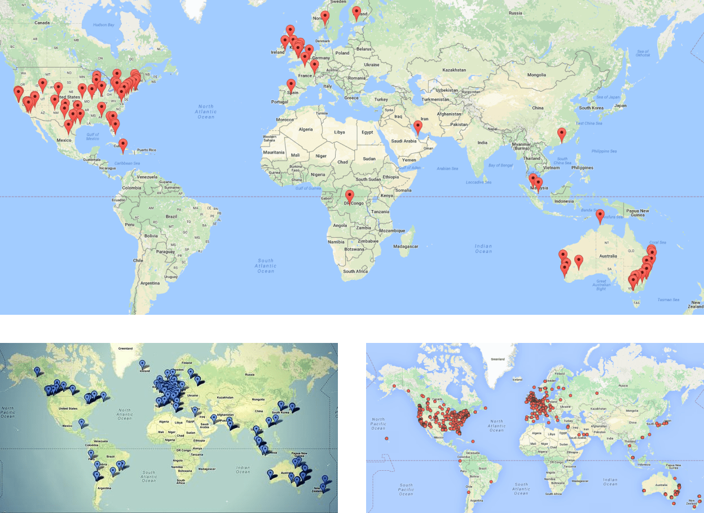
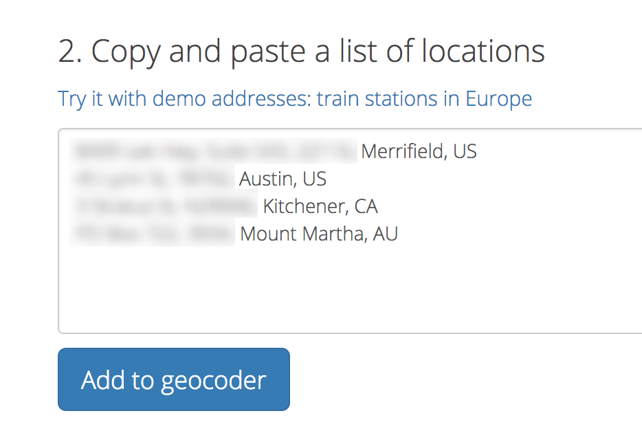
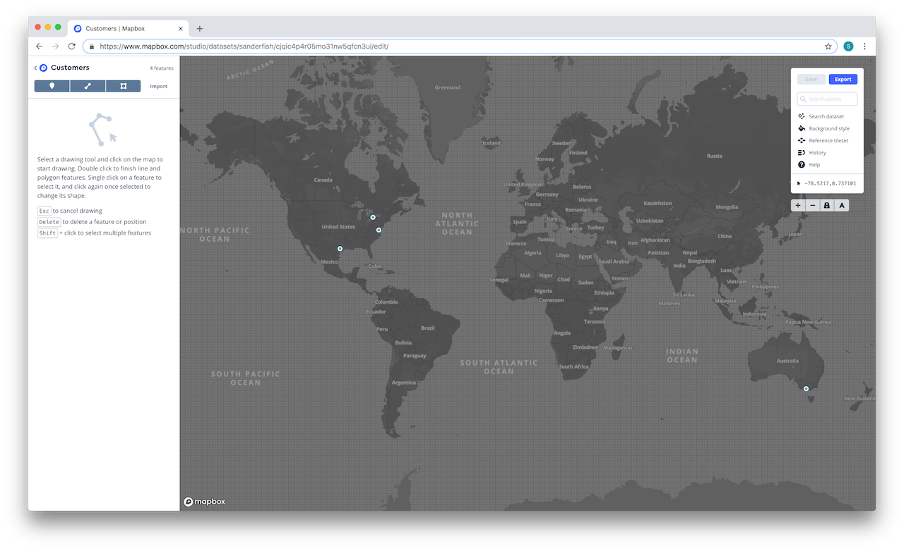
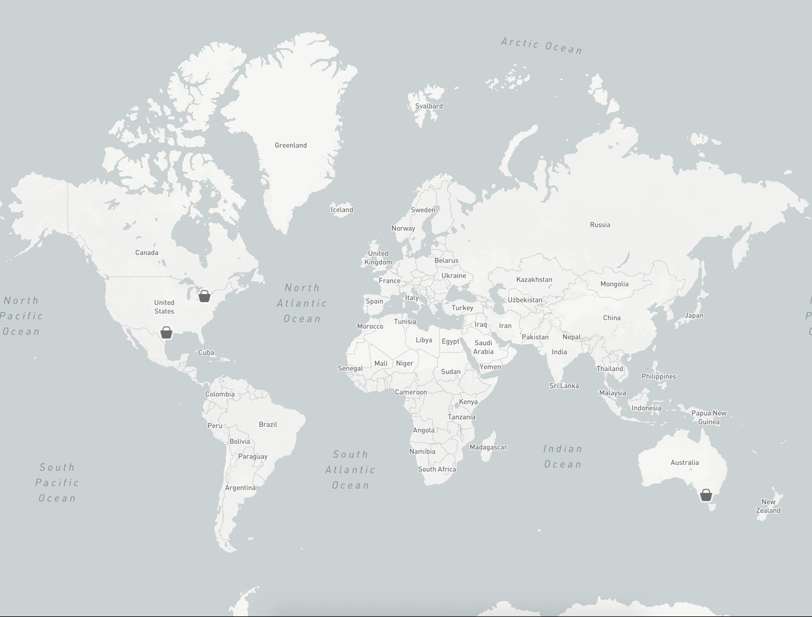

When you sell digital or physical products online, people all over the world (or country) buy your products. I thought it would be fun to see where the people that buy my products are from. Those type of maps are typically used for social proof as they show potential customers that you are a trusted business and have served customers globally.

It gives potential customers a feel of how many customers you have and where they are located. You could possibly add the order amount or the product bought as well, to give a better indication of which products are popular.


> > > Customer maps from <a href="https://www.databuzz.com.au/mapping-our-customers/" target="blank">Databuzz</a>, <a href="https://www.revolvecamera.com/blogs/news/7070364-to-every-corner-of-the-globe" target="blank">Revolve</a> and <a href="https://sofatray.eu/blogs/news/what-to-expect" target="blank">Sofatray</a>.

I'm going to make this map for my SaaS product [Checkout Page](https://checkoutpage.co). My customers are people who "connect" their [Stripe](https://stripe.com) account to my service. I have exported their data and turned it into a CSV file. The starting point of this tutorial will be you getting your customer or sales data as a CSV file.

<br />

---

If you think this is too much work — I'm building a tool that turns your data into a pretty map easily. You can leave your email here for an invite to the beta. If you want your map now, you can <a href="https://checkoutpage.co/checkout/sanderfish/customer-data-map" target="blank">pay me $20</a>, send me your address data and I will do it manually using an early version of my tool.

<div id="mc_embed_signup">
  <form action="https://sanderfish.us15.list-manage.com/subscribe/post?u=623bafe9c5e3900424bab0840&amp;id=67448ab113" method="post" id="mc-embedded-subscribe-form" name="mc-embedded-subscribe-form" class="validate" target="_blank" novalidate>
    <div id="mc_embed_signup_scroll">
      <div class="mc-field-group">
        <input type="email" value="" name="EMAIL" class="required email" id="mce-EMAIL" placeholder="Email address" style="margin: 0.5em 0; padding: 0.5em 1em;">
        <input type="submit" value="Subscribe" name="subscribe" id="mc-embedded-subscribe" class="button" style="padding: 0.55em; background: black; color: white; border: none;">
      </div>
      <div id="mce-responses" class="clear">
        <div class="response" id="mce-error-response" style="display:none"></div>
        <div class="response" id="mce-success-response" style="display:none"></div>
      </div>    <!-- real people should not fill this in and expect good things - do not remove this or risk form bot signups-->
      <div style="position: absolute; left: -5000px;" aria-hidden="true"><input type="text" name="b_623bafe9c5e3900424bab0840_67448ab113" tabindex="-1" value=""></div>
    </div>
  </form>
</div>

---

<br />
<br />

## 1. Get your customer/sales data as a CSV file

Most e-commerce platforms offer a way to export your sales or customer data. Often this export will be in the CSV format, which you can open in Google Sheets, Numbers (Mac OS) or Microsoft Excel. Here are some links that should help you to get your initial export for a couple of platforms:

- Shopify Orders [https://help.shopify.com/en/manual/orders/export-orders](https://help.shopify.com/en/manual/orders/export-orders)
- Shopify Customers [https://help.shopify.com/en/manual/customers/import-export-customers](https://help.shopify.com/en/manual/customers/import-export-customers)
- Etsy Orders [https://help.etsy.com/hc/en-gb/articles/360000343328-Downloading-a-Spreadsheet-of-Your-Sold-Transactions](https://help.etsy.com/hc/en-gb/articles/360000343328-Downloading-a-Spreadsheet-of-Your-Sold-Transactions)
- Stripe - Stripe payments and customers exports don't include Billing or Shipping addresses. It is however possible to get these via the API as JSON as explained here [https://stripe.com/docs/api/charges/list](https://stripe.com/docs/api/charges/list). I use the following code to save my customers to a json file, which I then convert to a CSV file via [https://konklone.io/json/](https://konklone.io/json/)

  ```
  curl https://api.stripe.com/v1/customers?limit=9999 \
    -u [YOUR_API_KEY]: \
    -G \
    -o data.json
  ```

- WooCommerce [https://docs.woocommerce.com/document/ordercustomer-csv-export/](https://docs.woocommerce.com/document/ordercustomer-csv-export/)
- SquareSpace [https://support.squarespace.com/hc/en-us/articles/206540677-Exporting-orders](https://support.squarespace.com/hc/en-us/articles/206540677-Exporting-orders)
- Wix [https://support.wix.com/en/article/exporting-orders-in-wix-stores](https://support.wix.com/en/article/exporting-orders-in-wix-stores)
- BigCommerce [https://support.bigcommerce.com/s/article/Importing-Exporting-Orders](https://support.bigcommerce.com/s/article/Importing-Exporting-Orders)

If you use a different ecommerce platform, simply Google '[name of your ecommerce platform] export orders' to find out how you can export your data.

<br />
<br />

## 2. Get coordinates from your addresses

To put the addresses of your orders or customers on a map, they need to be converted to coordinates. This process is called geocoding. The most accurate way to do this is by using the Google Maps API, but I didn't want to code. I found [a geocoding service](https://geocode.localfocus.nl/) that geocodes address data and returns it in CSV format.

Open up the CSV file you exported in step 1 in a spreadsheet editor (I use Google Sheets). To improve the accuracy of the geocoding tool it's best to organise your data in readable addresses. I aligned my columns like this:

| Address     | Postcode    | City        | Country     |
| ----------- | ----------- | ----------- | ----------- |
| ........... | ........... | ........... | ........... |
| ........... | ........... | ........... | ........... |

This allowed me to copy them into the geocoder easily and is also helpful to paste the results back in.



The service sometimes returns a lot of possible addresses, meaning you will have to select the correct address out of a list of options.

Once geocoded, you scroll down to the results and copy them. Go back to the CSV file and add two columns to the right of the `country` column: `latitude` and `longitude`. To prevent overwriting the original data, I created a new tab/spreadsheet in Google Sheets, where I pasted the results. I then selected all the `latitude` and `longitude` items and copied them to my clipboard. I then went back to the customer data spreadsheets and pasted the coordinate date in the `latitude` and `longitude` columns.

<br />
<br />

## 3. Export to CSV

You now want to export your data to a CSV file. Mapbox has some restrictions on what it can read. If you're running into issues, this document might help: [https://www.mapbox.com/help/troubleshoot-csv/](https://www.mapbox.com/help/troubleshoot-csv/).

A few gotchas:

- Some spreadsheet editors export all empty rows and unnamed columns. It can be worth removing the unused rows at the bottom and right of your data.
- Make sure your exported file contains Comma Separated Values and not Semicolon Separated Values. Mapbox only accepts the former.

<br />
<br />

## 4. Upload dataset to Mapbox

We'll use Mapbox to create the map. Mapbox offers some really nice map styles and you're able to customise them as well. If you don't have a Mapbox account yet, create one here [https://www.mapbox.com/signup/](https://www.mapbox.com/signup/).

To be able to map your data on a map in Mapbox, you need to add it as a dataset. Let's go to [Datasets](https://www.mapbox.com/studio/datasets/) in the studio dashboard to add it. Press the `New dataset` button, click the `upload` tab and upload your CSV file. Press confirm, give your dataset a name, click `Create` and click `Start editing`. You should be able to see your datapoints on a map now.



<br />
<br />

## 5. Convert data to a Tileset

To use the Dataset in the Styles editor, it needs to be converted to a Tileset. Go to [Tilesets](https://www.mapbox.com/studio/tilesets/) and click `New tileset`. Press the `Create from dataset` tab, select the dataset you just created in step 4 and export it to a tileset.

<br />
<br />

## 6. Add your data to a map

This is the fun part! We can finally design and create the map. Go to [Styles](https://www.mapbox.com/studio/) and create a new Style. You can start with the Basic style, use a template or upload a style yourself. I chose Light as it matches the design of [checkoutpage.co](https://checkoutpage.co), where I will use the map.

Now press the `Add layer` button and add your dataset to the list of active sources. You should now see your data appear on the map. Nice!

You can click the Type tab to change the looks of your data. This also allows you to use a value from the dataset you've uploaded, such as the total order amount. Once you've added your layer you can select it and change the way it looks, the positioning, et cetera. I'm going for the icon of a bag and because I don't have so many items mapped out, I'll make the icon a bit larger.

<br />
<br />

## 7. Use your map

I simply wanted an image, so I'm simply taking a screenshot of the map. If you need a larger image, for example to print, there's a print option in the top right corner. This is however [limited to 5 prints](https://www.mapbox.com/help/how-static-maps-work/) and needs to contain Mapbox attribution.



You can also embed your map interactively on your website. To do this, click `Share` and then `Use`. This will show some code you can copy and paste into your website to embed the map itself.

<br />
<br />

## No time to do all this?

This process takes quite some time, which is annoying. Especially if you want to make a new map next month, or next year. I'm working on a tool that automates most of the process. It's working, but I haven't built the interface yet. Want to hear more? Leave your email below. If you want your map **now**, you can <a href="https://checkoutpage.co/checkout/sanderfish/customer-data-map" target="blank">pay me $20</a>, send your raw data and I'll turn it into a map for you, using the tool I've built.
<br />
<div id="mc_embed_signup">
  <form action="https://sanderfish.us15.list-manage.com/subscribe/post?u=623bafe9c5e3900424bab0840&amp;id=67448ab113" method="post" id="mc-embedded-subscribe-form" name="mc-embedded-subscribe-form" class="validate" target="_blank" novalidate>
    <div id="mc_embed_signup_scroll">
      <div class="mc-field-group">
        <input type="email" value="" name="EMAIL" class="required email" id="mce-EMAIL" placeholder="Email address" style="margin: 0.5em 0; padding: 0.5em 1em;">
        <input type="submit" value="Subscribe" name="subscribe" id="mc-embedded-subscribe" class="button" style="padding: 0.55em; background: black; color: white; border: none;">
      </div>
      <div id="mce-responses" class="clear">
        <div class="response" id="mce-error-response" style="display:none"></div>
        <div class="response" id="mce-success-response" style="display:none"></div>
      </div>    <!-- real people should not fill this in and expect good things - do not remove this or risk form bot signups-->
      <div style="position: absolute; left: -5000px;" aria-hidden="true"><input type="text" name="b_623bafe9c5e3900424bab0840_67448ab113" tabindex="-1" value=""></div>
    </div>
  </form>
</div>

<br />
