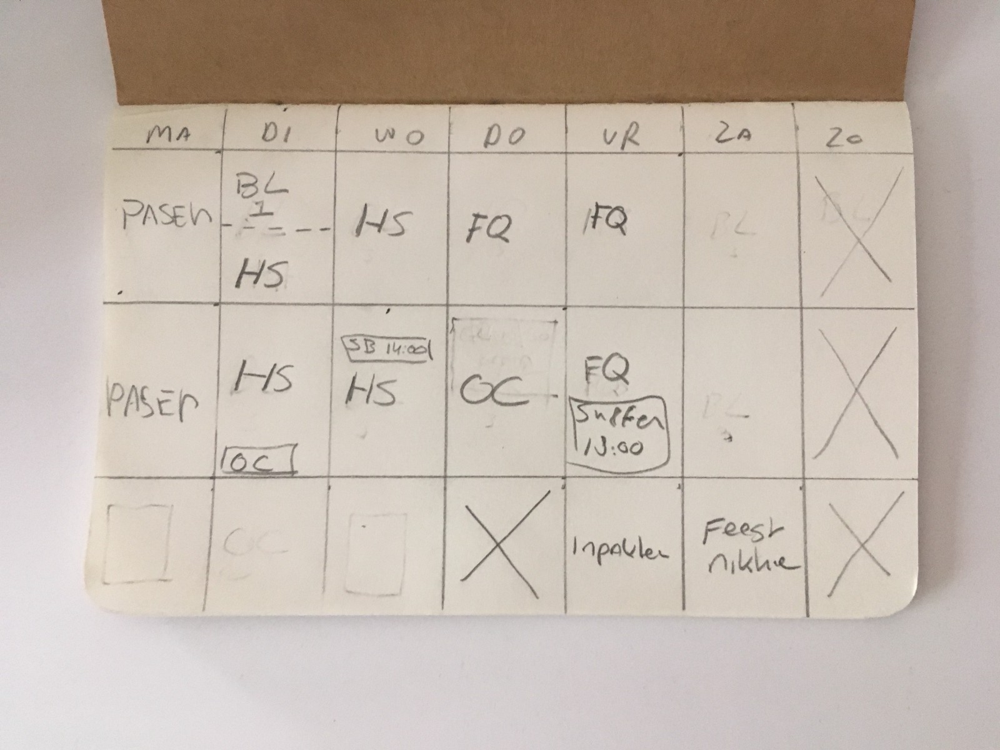
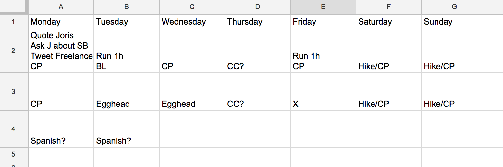
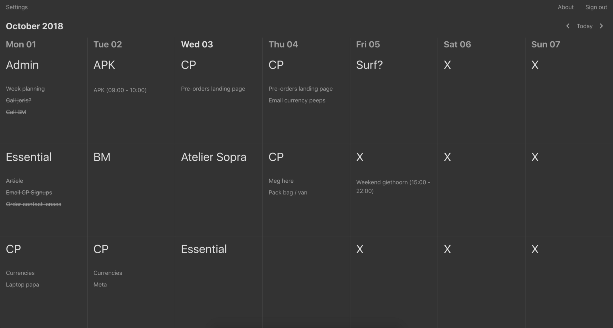

I’ve always struggled to concentrate on my tasks. My focus shifted constantly. I had to be in the perfect environment, have one clearly defined task to focus on and force myself not to touch anything distracting. It annoyed me. And every few weeks, it happened again. Sometimes weeks would go by without being productive.

Many times I searched for, found and tried ways to improve my focus. I tried todo lists, journaling, blocking websites, rewards, getting up early, working late, coffee, no coffee, music, no music, weed, noise canceling headphones, cafes, coworking spaces, working from home. The list goes on and on.

These changes all had some effect. Some improved my focus for a day, some for a week, some made it worse (yes, weed), but generally — what worked one day, wouldn’t work the next.

---
> > > While it’s obvious, it took me a long time to realise that as a maker, entrepreneur or independent worker, you have no manager. You need to manage yourself.
---

Earlier this year I was talking to my friend Joris de Ruiter about these struggles. I explained how it caused me to feel busy all week. It caused me to work 10 hour days because I didn’t get done what I wanted to achieve. And because I was so annoyed at my inability to focus I wouldn’t notice and appreciate the things that I did get done.

Joris walked to his room, came back with a notebook and said:

---
> > > “ I used to want to do so much in a week, that I was never able to finish everything which left me feeling unsatisfied. My psychologist then recommended me a system where I would divide the week into blocks, plan my week ahead and make sure I keep at least two blocks empty. This time I could spend on whatever comes up. Maybe this system works for you too. Look. ”
---

> > > Joris showed me what his system looked like for a typical week.

The idea is that every day consists of three blocks. Morning, afternoon and evening. Each block needs to have a priority. That is your primary focus during that block. Sometimes it is inevitable to have something going on besides your priority, hence you see on Tuesday morning 1 hour of BL, and a meeting at 2pm on Wednesday afternoon. For Joris, the point was that a few of his blocks were kept empty. Blocked. Like Thursday evening and the whole of Sunday. This helped him create time to think, to do spontaneous things or to work on things that he had underestimated.

Yet, my problem wasn’t anything to do with overworking myself or feeling like I didn’t have enough time in the week. My problem was that I seemingly randomly had days on which I was unable to focus. Days on which I had no idea what to work on and where I would get distracted every 5 minutes.

After trying the system for a few weeks, it turned out that this planning system brings me clarity and focus. I was sold. It worked and it still does. I’ve been using it for months now and am still pleased with how it helps me. Joris has been using it for years, the same story.

*A little side story — A surprising thing that happened to me is that when I plan my week ahead, I think of things I never make time for during the week. Activities like working out, trying a recipe I found, practicing a language or an instrument. While planning they pop in my head and I write them down. Somehow seeing these things written down creates the time to do them. They’re no longer optional, nice-to-haves in your head, but they are there, important enough to be in your planning. It’s sort of an agreement you make with yourself.*

## How do you start using the system?

Potentially, after reading this, you’ve been inspired to try it yourself and see if it works for you. There are a couple of ways you can start. The one you saw above is the simplest, most manual one — a piece of paper.

After I used paper for a while, it was annoying that I always needed to have my notebook with me. I used Google Sheets to create a simple layout and duplicated that every week.

> > > Simple spreadsheet setup.

In the meantime, it turned out, Joris had started turning it into a web app. After he used that for a couple of months, he finally showed it to me (after I had been duplicating and clearing my spreadsheet every week, thanks Joris). We thought it had potential, at least for us, so we worked together to make a new version and we named it [Essential](https://essentialcal.com):

> > > [https://essentialcal.com](https://essentialcal.com)

## But how do you plan?

Although we believe that the system should be flexible because everyone is different, this should be a good start until you find your own strategy:
Spend around 20 minutes on Sunday night or Monday morning to make your planning for the week. In your notebook, somewhere on your spreadsheet or in a notes app, write down the priorities you have in the coming week, what activities you want to do and what appointments you have.

The next step is to divide those priorities over the week. It’s good to sometimes move priorities around a bit until it feels right. I usually don’t put similar tasks on the same day as I like some contrast (e.g. programming in the morning, emailing in the afternoon), but again, this might be different for you. Keep in mind that it’s all about setting a priority. It doesn’t matter what exact tasks you will be working on in those blocks. You’re just reserving time for your priority here.

Once you’ve added your priorities, you’re all set! Joris and I decided to add a task list and calendar integration to Essential as we felt like we needed some room for side notes and because it’s handy to see what appointments you have, but this is by no means required. Keep the main thing the main thing!

This is the first time we share this system (and Essential) outside of our personal context. If you try it, in any way, we would love to hear what your experiences are. If you want to talk about it or have questions, you can reach me on Telegram and on Twitter. Links below ⬇️

[Essential](https://essentialcal.com/)

[Telegram](https://t.me/sanderfish)

[Twitter](https://twitter.com/fishsander)